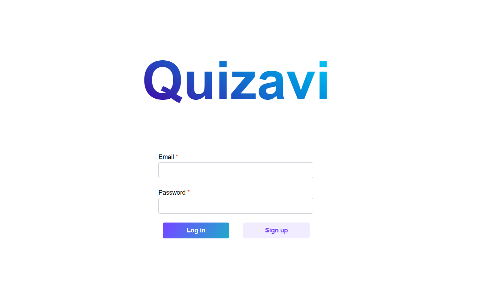
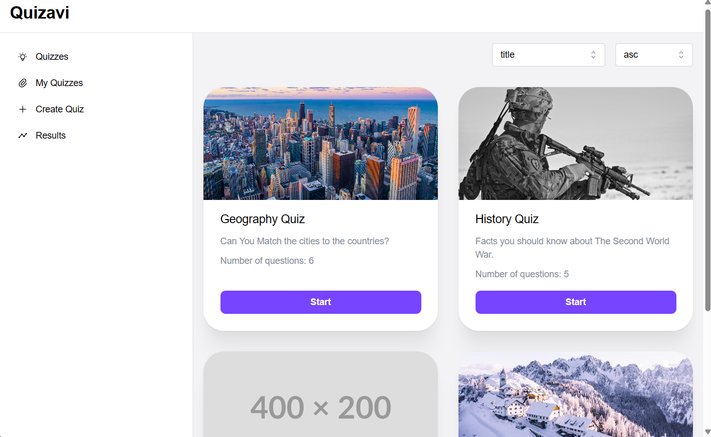
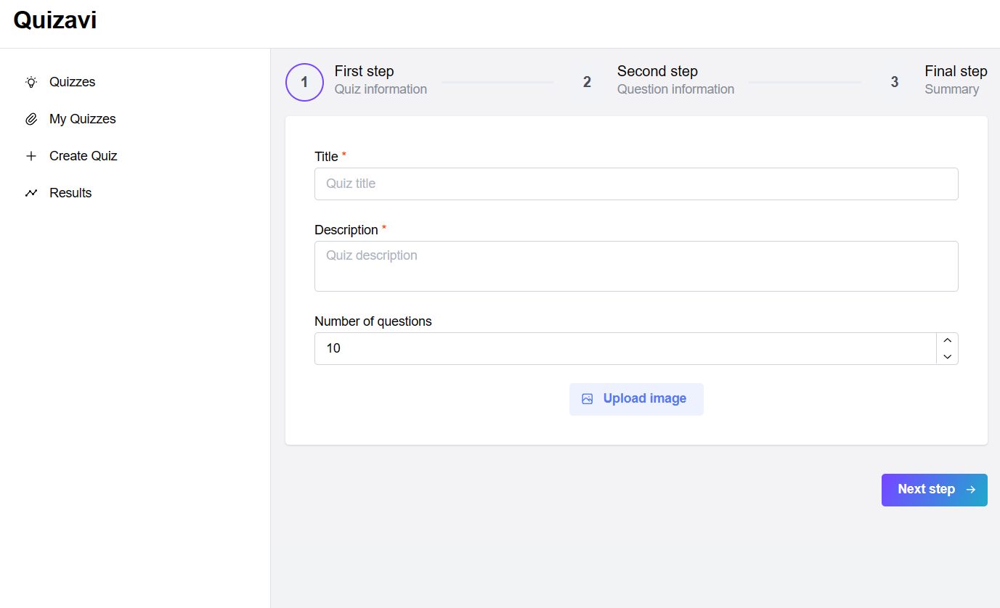
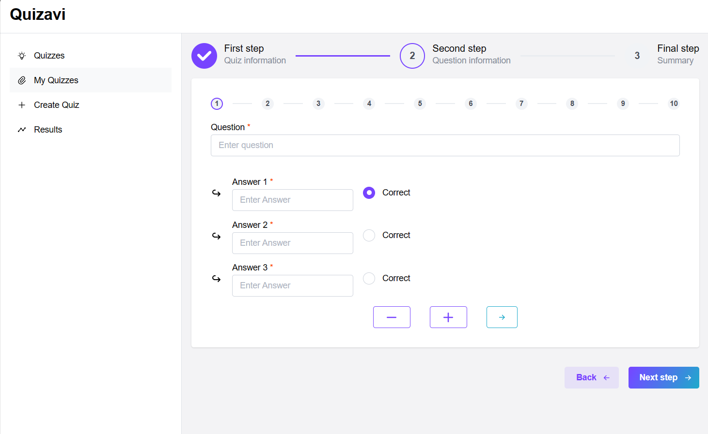
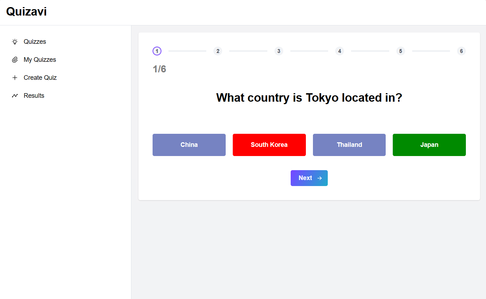
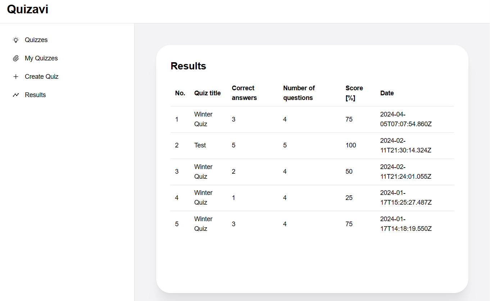

## Quizavi

Quizavi is a web platform that enables users to create quizzes for others. The application requires user authorization. Quizzes can be sorted by date, title and number of questions in ascending or descending order. Quiz can be deleted only by its author. Quiz results are saved and can be viewed in a dedicated tab.

## Requirements

- Node.js v18.18.2 or greater
- npm

## Install and Start

- React Client
```
cd client
npm install
npm start 
```

- NestJS Server
```
cd server
npm install
npm run start:dev
```

More details on available scripts are described separately for the client and server sides in their README files.

To log in, the application should be listened to on port: http://localhost:3000/login.

Sample login details in the database: test1@example.com, password123

## Screenshots

Login page


Home page


Quiz creation page



Quiz solving page


Quiz results page
